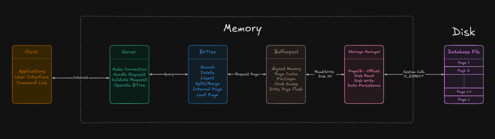
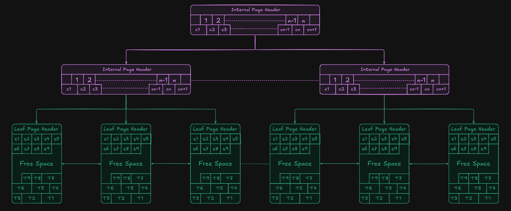
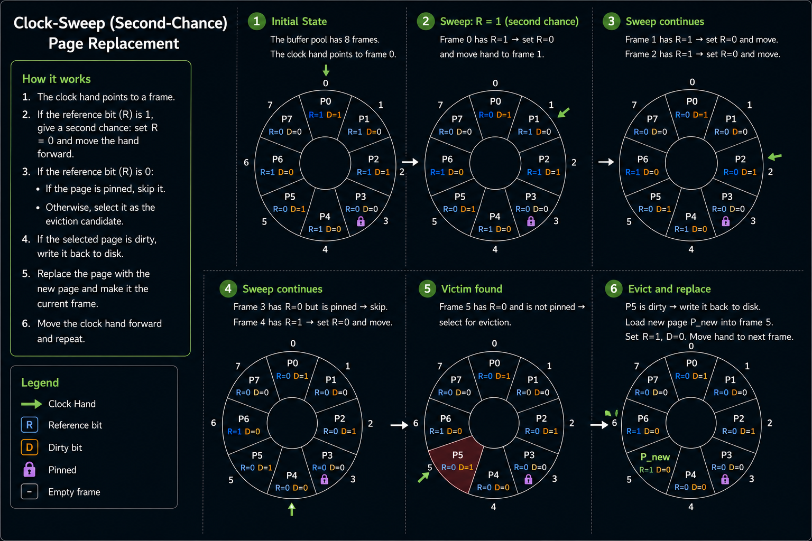

# Architecture
## Table Of Content

- [High-Level Architecture](#high-level-architecture)
- [B+ Tree Details](#b-tree-details)
- [Page Headers](#page-headers)
- [Buffer Pool Details](#buffer-pool-details)
- [Storage Manager Details](#storage-manager-details)

## High-Level Architecture



The storage engine is organized into a set of independent components, each responsible for a specific stage of request processing. Except for the database file itself, every component executes entirely in memory and communicates through well-defined interfaces.

### Client

The client represents any application communicating with the database, including the demonstration command-line interface. It serializes requests into the custom binary protocol and displays responses returned by the server.

### Server

The server owns all client connections and acts as the entry point into the storage engine.

Its responsibilities include:

- Accepting TCP connections
- Parsing and validating requests
- Dispatching operations to the B+ tree
- Serializing responses back to the client

The server itself is intentionally lightweight and does not directly access disk pages.

### B+ Tree

The B+ tree implements the core indexing logic of the storage engine.

It is responsible for:

- Search
- Insertion
- Deletion
- Node splitting
- Node redistribution
- Node merging

The B+ tree never performs disk I/O directly. Instead, it requests pages from the buffer pool using page identifiers.
For further details look at the **B+ Tree Details** section below.

### Buffer Pool

The buffer pool manages all in-memory pages and serves as the interface between the B+ tree and persistent storage.

Its responsibilities include:

- Allocating aligned page buffers
- Caching pages in memory
- Pinning and unpinning pages
- Tracking dirty pages
- Clock-Sweep page replacement
- Flushing modified pages back to disk

By caching frequently accessed pages, the buffer pool significantly reduces the number of physical disk accesses.
For further details look at the **Buffer Pool Details** section below.

### Storage Manager

The storage manager is the only component responsible for interacting with the operating system.

Its responsibilities include:

- Reading fixed-size pages from disk
- Writing dirty pages back to disk
- Allocating new pages
- Managing page identifiers
- Extending the database file

Disk I/O is performed using `O_DIRECT`, bypassing the Linux page cache. This allows the database to manage its own caching policy through the buffer pool.
For further details look at the **Storage Manager Details** section below.

### Database File

The database file is a sequence of fixed-size pages.

Each page stores one of several page types, including:

- Metadata pages
- Internal B+ tree pages
- Leaf pages
- Overflow pages

Pages are referenced exclusively through page identifiers and remain persistent across process restarts.

### Request Flow

A typical request follows this sequence:

1. The client sends a request to the server.
2. The server validates the request and invokes the appropriate B+ tree operation.
3. The B+ tree requests the required pages from the buffer pool.
4. If the pages are not cached, the buffer pool asks the storage manager to read them from disk.
5. The storage manager performs aligned direct I/O and returns the requested pages.
6. The B+ tree performs the requested operation.
7. Modified pages are marked dirty and eventually flushed back to disk by the buffer pool.
8. The server serializes the result and sends the response to the client.

---

## B+ Tree Details



- The B+ tree is the primary storage structure of the database. Every node is persisted as a fixed-size page on disk and is fetched through the buffer pool when required. The implementation is a **clustered index**, meaning leaf pages store complete tuples instead of record identifiers pointing to a separate heap. This eliminates an additional lookup during point queries and simplifies storage management.
- Large tuples that cannot fit entirely within a leaf page are transparently stored across dedicated overflow pages while remaining logically associated with the owning leaf page.

### Internal Pages

- Internal pages contain **n** separator keys and **n + 1** child pointers.
- Child pointers are page identifiers that reference other B+ tree pages stored on disk.
- Searches perform a binary search over the separator keys to determine the child page to visit next.

### Leaf Pages

- Leaf pages use a slotted-page layout to store variable-sized tuples.
- The slot directory grows downward from the beginning of the page.
- Tuple data grows upward from the end of the page.
- The unused region between them represents the page's free space.
- Leaf pages are connected through doubly-linked sibling pointers to support efficient sequential traversal and future range scans.
- Search operations return a streaming payload interface, allowing tuple data to be consumed incrementally.

### Insertion

- Tuples are inserted into the appropriate leaf page while maintaining sorted key order.
- Pages are split only when a tuple cannot fit, even after page defragmentation.
- Splits propagate recursively toward the root when necessary.

### Deletion

Deletion is implemented using **lazy deletion**.

Instead of immediately reclaiming storage, tuples are marked as deleted. This minimizes data movement for variable-sized records and significantly reduces write amplification.

Pages are only defragmented when additional contiguous free space is required for insertion.

When a leaf page underflows, the implementation first attempts redistribution with a sibling. If redistribution is not possible, the pages are merged. The same redistribution and merge logic is implemented for internal pages.

Deleted tuples continue occupying physical space until reclamation becomes necessary.

### Overflow Pages

If a tuple exceeds the maximum payload that may be stored inside a leaf page, it is divided into chunks.

The first chunk is stored directly inside the leaf page while the remaining bytes are stored in dedicated overflow pages linked together.

### Choosing the Underflow Threshold

The implementation defines

```cpp
constexpr uint16_t MAX_LEAF_PAGE_DATA = THRESHOLD_UNDERFLOW / 2;
```

This choice serves two purposes.

First, it guarantees that every leaf page can always contain **at least three tuples**, regardless of tuple sizes. Since the largest tuple that may reside inside a leaf page occupies at most half of the underflow threshold, two such tuples occupy exactly one underflow threshold, leaving enough remaining space for at least one additional tuple.

Second, it guarantees that every underflow can always be resolved by either redistribution or merging.

The worst case occurs when redistribution is impossible because borrowing even the smallest legal tuple would cause the sibling to underflow.

Assume the current page has just underflowed:

```text
Current page size = THRESHOLD_UNDERFLOW
```

The sibling cannot donate a tuple, meaning its occupancy is

```text
Sibling size =
THRESHOLD_UNDERFLOW +
THRESHOLD_UNDERFLOW / 2
```

The merged page therefore contains

```text
THRESHOLD_UNDERFLOW +
(THRESHOLD_UNDERFLOW + THRESHOLD_UNDERFLOW / 2)
=
(5 / 2) × THRESHOLD_UNDERFLOW
```

For the merge to always succeed,

```text
(5 / 2) × THRESHOLD_UNDERFLOW ≤ UsablePageSpace
```

which simplifies to

```text
THRESHOLD_UNDERFLOW ≤ (2 / 5) × UsablePageSpace
```

Therefore, the implementation chooses an underflow threshold equal to **40% of the usable leaf page space**. Together with the constraint on `MAX_LEAF_PAGE_DATA`, this guarantees:

- Every leaf page stores at least **three tuples**.
- Every underflow can always be resolved through redistribution or merging.
- No merge can produce an overfull page.

**Design Guarantees**

- Every leaf page stores at least three tuples.
- Every underflow can always be resolved through redistribution or merging.
- No merge can ever overflow the destination page.
---

## Page Headers

Every page stored in the database begins with a compact header that describes the page and provides the metadata required to interpret its contents. Although all pages share the common fields `page_type` and `page_id`, each page type extends the header with metadata specific to its role in the storage engine.

All page headers are packed using `__attribute__((packed))` to guarantee a consistent on-disk layout without compiler-inserted padding.


### Leaf Page Header

The leaf page header maintains the metadata required to manage a slotted page containing variable-sized tuples.

| Field | Description |
|-------|-------------|
| `page_type` | Identifies the page as a leaf page. |
| `page_id` | Unique identifier of the page within the database file. |
| `free_space_end_offset` | Offset of the first free byte immediately before the tuple region. Since tuples grow upward from the end of the page, this value marks the boundary between free space and tuple storage. |
| `slot_array_size` | Total number of slot entries currently present in the slot directory, including both live tuples and lazily deleted tuples that have not yet been reclaimed. |
| `garbage_bytes` | Total number of bytes occupied by lazily deleted tuples. This value is used to determine when page defragmentation should be performed. |
| `left_pid` | Page identifier of the left sibling leaf page. |
| `right_pid` | Page identifier of the right sibling leaf page. |

The combination of `free_space_end_offset`, `slot_array_size`, and `garbage_bytes` enables the storage engine to determine whether a tuple can be inserted directly, whether the page should first be defragmented, or whether the page must be split.

---

### Internal Page Header

Internal pages contain only separator keys and child page identifiers. Since every entry has a fixed size, internal pages do not suffer from fragmentation and therefore require significantly less metadata than leaf pages.


| Field | Description |
|-------|-------------|
| `page_type` | Identifies the page as an internal page. |
| `page_id` | Unique identifier of the page within the database file. |
| `num_keys` | Number of separator keys stored in the page. The page therefore contains `num_keys + 1` child pointers. |

The header is intentionally minimal because the remaining page contents consist entirely of fixed-size separator keys and child page identifiers.

---

### Overflow Page Header

Overflow pages store the portion of a tuple that cannot fit inside its owning leaf page. Multiple overflow pages may be chained together to represent arbitrarily large payloads.


| Field | Description |
|-------|-------------|
| `page_type` | Identifies the page as an overflow page. |
| `page_id` | Unique identifier of the page within the database file. |
| `overflow` | Indicates whether another overflow page follows this page. A value of `false` marks the final page in the chain. |
| `overflow_page` | Page identifier of the next overflow page. Ignored when `overflow` is `false`. |

During tuple retrieval, overflow pages are traversed sequentially until a page whose `overflow` flag is `false` is encountered, indicating that the complete payload has been reconstructed.

---

## Buffer Pool Details

The buffer pool is responsible for managing all pages resident in memory. Rather than allowing the B+ tree to perform disk I/O directly, every page request is routed through the buffer pool. This abstraction provides page caching, memory management, and page replacement while completely hiding the underlying storage layer from the B+ tree.

Pages are allocated using aligned memory to satisfy the requirements of direct I/O (`O_DIRECT`). Once a page has been loaded into memory, subsequent accesses are served directly from the buffer pool until the page is evicted.

### Page Lookup

Whenever the B+ tree requests a page:

1. The buffer pool checks whether the page is already cached.
2. If present, the cached page is returned immediately.
3. Otherwise, a free frame is obtained or an existing page is evicted.
4. The storage manager loads the requested page from disk.
5. The page is inserted into the page table and returned to the caller.


### Page Table

The buffer pool maintains a page table that maps every cached `PageID` to its corresponding buffer frame. This allows page lookups to be performed in constant expected time without scanning the entire buffer pool.

Whenever a page is loaded from disk, a new entry is inserted into the page table. Likewise, when a page is evicted, its mapping is removed before the frame is reused.

### Pinning

Pages currently being accessed by higher layers are **pinned**, preventing them from being selected for eviction.

Each page maintains a pin count, which is incremented whenever the page is acquired and decremented when it is released. Only pages whose pin count reaches zero become eligible for replacement by the Clock-Sweep algorithm.

This guarantees that pages currently participating in B+ tree operations cannot be evicted while still in use.

### Clock-Sweep Replacement


The buffer pool uses the **Clock-Sweep** page replacement algorithm.

Each page maintains a reference bit indicating whether it has been accessed recently. During eviction, the clock hand continuously scans the buffer pool:

- Pages with the reference bit set are given a second chance by clearing the bit.
- Pages whose reference bit is already cleared become eviction candidates.
- Dirty pages are flushed to disk before eviction.
- Clean pages are immediately reused.

Clock-Sweep approximates LRU while requiring only constant-time metadata updates.

### Dirty Pages

Whenever the B+ tree modifies a page, it is marked **dirty**.

Dirty pages remain in memory until they are either selected for eviction or explicitly flushed. This allows multiple updates to be coalesced into a single disk write, significantly reducing write amplification.

---

## Storage Manager Details

The storage manager is the lowest layer of the storage engine and is solely responsible for persistent storage. It performs no caching and has no knowledge of B+ tree semantics. Its only responsibility is reading and writing fixed-size pages to the database file.
The storage manager is completely stateless. It performs no caching and simply translates page requests into aligned reads and writes against the database file.

### Responsibilities

- Reading pages from disk
- Writing pages to disk
- Allocating new pages
- Extending the database file
- Translating page identifiers into file offsets

### Direct I/O

All disk operations are performed using Linux's `O_DIRECT` flag.

By bypassing the operating system's page cache, the database gains complete control over page caching through its own buffer pool. This avoids duplicate caching between the operating system and the database engine while making page replacement entirely deterministic.

Because `O_DIRECT` requires aligned memory, every page buffer is allocated using aligned memory before any disk operation is performed.

### Database Layout

The database is stored as a single file consisting of fixed-size pages.

Every page is uniquely identified by a `PageID`. The storage manager converts a page identifier into its corresponding byte offset using

```text
offset = PageID × PAGE_SIZE
```

and performs direct reads or writes at that location.

Since every persistent page passes through the storage manager, higher layers remain completely independent of the underlying storage medium and file layout.

---